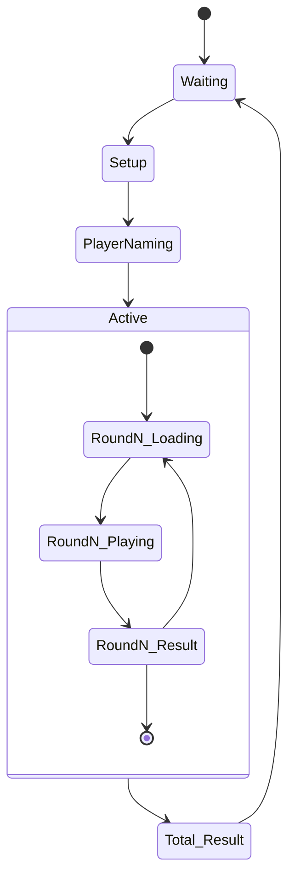

## 概要

- 2人1組のペアでプレイするアーケードゲームである
- 最初にイントロ画面で2人の関係性を選択し、続いて各プレイヤーが自分の画面で名前を入力する。関係性に応じたゲームを3つAIが選択してプレイヤーに出題する。
- 2人がそれぞれ別の画面(プレイヤー画面)に着き、AIから出題されるゲームをプレイする
- 1回のプレイの中にゲームが3つあり、それぞれ Round 1 〜 3 として区別して連続で出題される。
- Round ごとのプレイの状況(片方だけが相方のことを知っている、2人の理解度は同じ、など、定性的な評価)と得点を記録する。
- ゲーム終了後、獲得した得点とそれぞれのラウンドごとの定性評価をもとに、2人の相性を評価して画面に表示する。

## ハードウェア構成

- LG LD290EJS-FPN1 (2台。プレイヤー画面に使用)
- ノートPC(イントロ画面とサーバに使用)

## 画面構成

- イントロ画面
  - スタート画面: 1枚絵で背景だけ移動
  - 設定画面: 2人の関係性（"カップル" / "気になっている" / "友達" / "親子" の4択ボタン）を選択
  - 名前入力待機画面: 各プレイヤーが自分のプレイヤー画面で名前を入力するまで待機する
  - ガイド画面: プレイヤーにプレイヤー画面の前への移動を指示する(プレイヤー画面が物理的に2つあるので、それぞれどちらがどの画面に配置してほしいか指示する)
- プレイヤー画面
  - ラウンド開始画面: Round 1〜3 までの開始画面。AIがゲームの選択などで時間がかかるので、ローディング画面として使う。
  - ゲーム画面: 1画面完結のゲームを表示し、プレイヤーにプレイさせる。
  - ラウンド終了画面: Round 1〜3それぞれの終了画面。前のラウンドの定性評価をもとにプレイヤーを煽るようなコメントを表示する。
  - 最終結果: 2人の関係性と、Round 1〜3 までの得点と定性評価をもとにAIが最終的な判定を行い、2人の相性を申し渡す。

## 状態遷移

システム全体として次のステートと繊維を持つ

## 技術的観点

### 構成

- サーバはノートPC上でnode.jsにて実行する。
- 各画面はWebアプリとし、ノートPCのnode.jsから配信する。
- BGMはノートPCのnode.jsバックエンドからMIDIでMIDI音源に対して出力する。

### ゲームの制御について

- ゲームは3種類以上あり、開始時にAIがゲームを選択し、Round 1〜3の3つを出題する。
- ゲーム画面のコンポーネントはあらかじめF-Eに組み込んでおき、表示内容の制御に関する情報をREST API及びWeb SocketでB-Eからプレイヤー画面のF-Eに渡す。
- ゲームの設定は同一ラウンドでもプレイヤーごとに異なる内容を渡す可能性がある。

### AI使用箇所

- AIはGeminiをAPIで呼び出して使用する。
- AIの使用箇所は以下を想定
  - 2人の関係性をもとにしたゲーム内容の選択
  - Roundごとの定性評価
  - 最終結果画面の評価